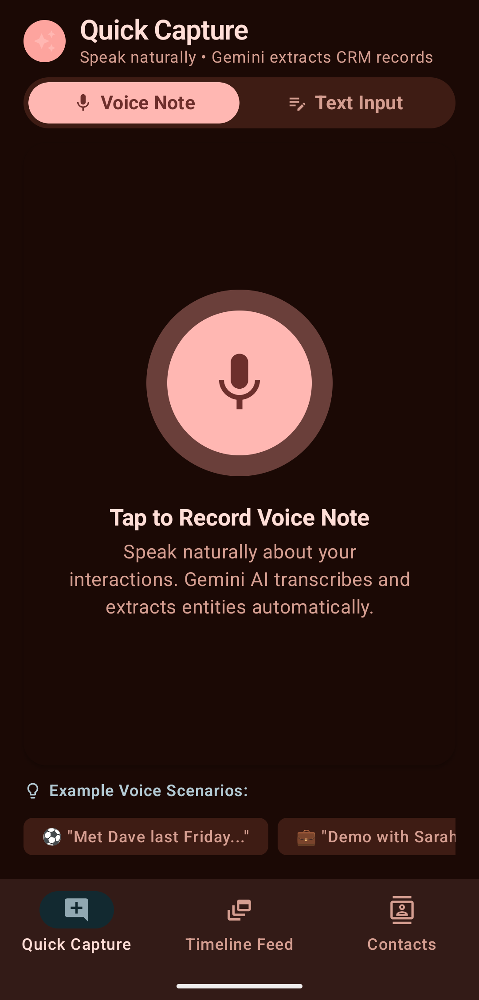
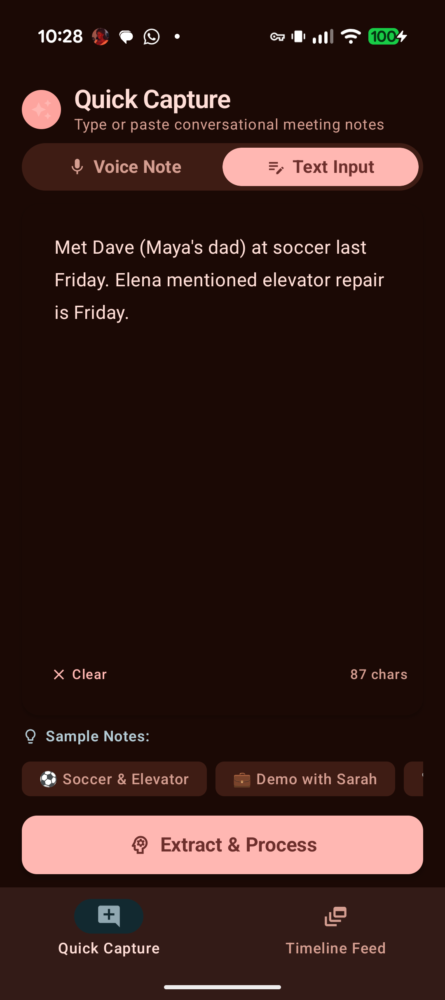

# ⚡ Sidekick CRM

<div align="center">

**A modern, cloud-native Personal Relationship Manager powered by Google Gemini 3.5 Flash and Firebase Firestore.**

[](https://kotlinlang.org)
[](https://developer.android.com)
[](https://developer.android.com/jetpack/compose)
[](https://ai.google.dev/)
[](https://firebase.google.com/)
[](LICENSE)

</div>

---

## 📖 Overview

**Sidekick CRM** transforms unstructured thoughts, spoken voice memos, and informal meeting notes into structured, searchable CRM records. Built with Android Jetpack Compose (Material 3), Sidekick connects directly to Google Gemini 3.X multimodal models and Firebase Firestore to provide an instant, voice-first personal relationship memory.

---

## 📱 Screenshots & UI / UX

<div align="center">
<table>
  <tr>
    <td align="center" width="50%">
      <b>🎙️ Voice Note Mode</b><br>
      <i>1-Tap Native Voice Memo Recording</i><br><br>
      
    </td>
    <td align="center" width="50%">
      <b>✍️ Text Input Mode</b><br>
      <i>Conversational Note Capture & Samples</i><br><br>
      
    </td>
  </tr>
</table>
</div>

---

## ✨ Key Features

### 🎙️ Native Multimodal Audio Capture
- Ingests raw voice recordings directly into Gemini's multimodal audio encoder without intermediary speech-to-text engines.
- Jointly transcribes and extracts entities in a single forward pass, preserving acoustic nuances, speaker context, and proper nouns.

### ⚡ Ultra-Low Latency Streaming (`thinkingBudget: 0`)
- Configured with `thinkingBudget: 0` for direct generation, cutting turnaround time down to **~1.0s – 1.6s**.
- Streaming Server-Sent Events (SSE) progressively updates the UI token-by-token.
- Automatic fallback cascade across `gemini-3.5-flash` $\to$ `gemini-3.6-flash` $\to$ `gemini-3.7-flash` $\to$ `gemini-3.5-flash-lite`.

### 📅 Temporal Context & Relative Date Resolution
- Automatically resolves relative date phrases (e.g., *"Met Dave last Friday"*, *"Elevator repair is next Tuesday"*, *"Spoke yesterday"*) into precise calendar dates (`YYYY-MM-DD`) anchored to the user's current date and timezone.

### 👥 Multi-Entity & Relationship Disambiguation
- Parses multiple people, companies, familial connections (e.g., *"Maya's dad"*), action items, and topic tags from a single note.
- Live review and diff cards allow in-line editing before saving to the cloud.

### ☁️ Cloud Persistence & Real-Time Sync
- Powered by Firebase Cloud Firestore.
- Real-time synchronization across all your Android devices.

### 🔍 Semantic & Temporal Timeline Feed
- Browse interactions chronologically or search across conversations using keyword matching and semantic vector similarity.

---

## 🏗️ Architecture & Tech Stack

```
com.cloudcrm.app
├── data/
│   ├── ai/
│   │   ├── GeminiCloudService.kt      # Gemini 3.X SSE Streaming & Multimodal Audio
│   │   └── GeminiSchema.kt            # Structured JSON Schemas & Prompts
│   ├── firebase/
│   │   └── FirestoreService.kt        # Cloud Firestore CRUD & Snapshot Listeners
│   └── model/
│       ├── CrmModels.kt               # Contact, Interaction, and Tag data classes
│       └── ExtractedEntityDiff.kt     # Streaming Diff state models
├── ui/
│   ├── CaptureScreen.kt               # Voice & Text Quick Capture screen
│   ├── StreamingDiffScreen.kt         # Real-time Diff & Entity Review screen
│   ├── SemanticTimelineScreen.kt      # Chronological Timeline & Search screen
│   ├── navigation/
│   │   └── CrmNavigation.kt           # Jetpack Compose Navigation
│   └── theme/                         # Material 3 Theme, Color & Typography
├── viewmodel/
│   └── CloudCrmViewModel.kt           # MVVM StateFlow Coordinator & Voice Recorder
└── CloudCrmApplication.kt             # Application lifecycle & configuration
```

- **UI Layer:** Jetpack Compose, Material 3, Coroutines, StateFlow.
- **AI / LLM:** Google Gemini 3.5 Flash via REST SSE Streaming & Google GenAI SDK.
- **Cloud Backend:** Firebase Firestore & Firebase Auth.
- **Networking:** OkHttp 4.12.0 with streaming `BufferedSource`.

---

## 🚀 Getting Started

### Prerequisites
- **Android Studio** Ladybug (2024.2.1) or newer
- **JDK 17**
- **Android SDK** API level 35 (Android 15)
- A **Google Gemini API Key** from [Google AI Studio](https://aistudio.google.com/)

### Clone the Repository
```bash
git clone https://github.com/justinwhite/sidekick.git
cd sidekick
```

### Configuration

#### 1. Gemini API Key
You can configure your Gemini API key in one of two ways:

- **Option A (In-App Setup):** Launch the app, tap **Setup** in the top banner, paste your Gemini API key, and tap **Save**.
- **Option B (Resource XML):** Create `app/src/main/res/values/crm_config.xml`:
  ```xml
  <?xml version="1.0" encoding="utf-8"?>
  <resources>
      <string name="gemini_api_key">YOUR_GEMINI_API_KEY_HERE</string>
  </resources>
  ```

#### 2. Firebase Setup (Optional for Cloud Sync)
1. Create a project in the [Firebase Console](https://console.firebase.google.com/).
2. Enable **Cloud Firestore**.
3. Download `google-services.json` and place it in the `app/` directory.

---

## 🛠️ Build & Run

### Build Debug APK
```bash
./gradlew assembleDebug
```

### Run Unit Tests
```bash
./gradlew test
```

### Install on Device via ADB
```bash
adb install -r app/build/outputs/apk/debug/app-debug.apk
adb shell am start -n com.cloudcrm.app/.MainActivity
```

---

## 📄 License

```
Copyright 2026 Sidekick Contributors

Licensed under the Apache License, Version 2.0 (the "License");
you may not use this file except in compliance with the License.
You may obtain a copy of the License at

    http://www.apache.org/licenses/LICENSE-2.0

Unless required by applicable law or agreed to in writing, software
distributed under the License is distributed on an "AS IS" BASIS,
WITHOUT WARRANTIES OR CONDITIONS OF ANY KIND, either express or implied.
See the License for the specific language governing permissions and
limitations under the License.
```
